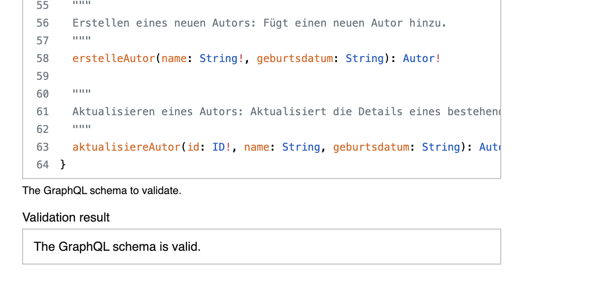

# Auftrag Schnittstellenbeschreibung

## Aufgabe 1: Wahl des Schnittstellendefinitionsformats
Für den ersten Schritt wähle ich GraphQL. Es eignet sich oft sehr gut für APIs, bei denen die Daten, wie in diesem Fall Bücher und Autoren, stark miteinander verknüpft sind.

## Aufgabe 2: Umwandlung in eine GraphQL-Schnittstellendefinition
Basierend auf der Beschreibung habe ich die Anforderungen in das GraphQL Schema Definition Language (SDL) Format umgewandelt. Die Definition umfasst die Datentypen Buch und Autor sowie die notwendigen CRUD operationen.

[Link zum Schema](schema.graphql)

### Erläuterungen zum Schema:

Typen (Buch, Autor): Definieren die Struktur der Datenobjekte. Das !-Zeichen bedeutet, dass ein Feld nicht leer (non-nullable) sein darf.

Query: Bündelt alle read Abfragen, um Daten zu lesen. Zum Beispiel für alle Bücher oder mit buch(id: "123") für ein spezifisches Buch.

Mutation: Bündelt alle CRUD Operationen abgesehen von der read operation. Also erstellen, bearbeiten und löschen von Büchern und Autoren.

autorenIDs: [ID!]!: Beim Erstellen eines Buches werden die IDs der bereits existierenden Autoren übergeben, um die Verknüpfung herzustellen.

## Aufgabe 3: Validierung der Schnittstellendefinition
Mein GraphQL-Schema habe ich mit [diesem](https://www.leskoff.com/s01929-0) GraphQL Schema Validator überprüft und es ist syntaktisch korrekt.

